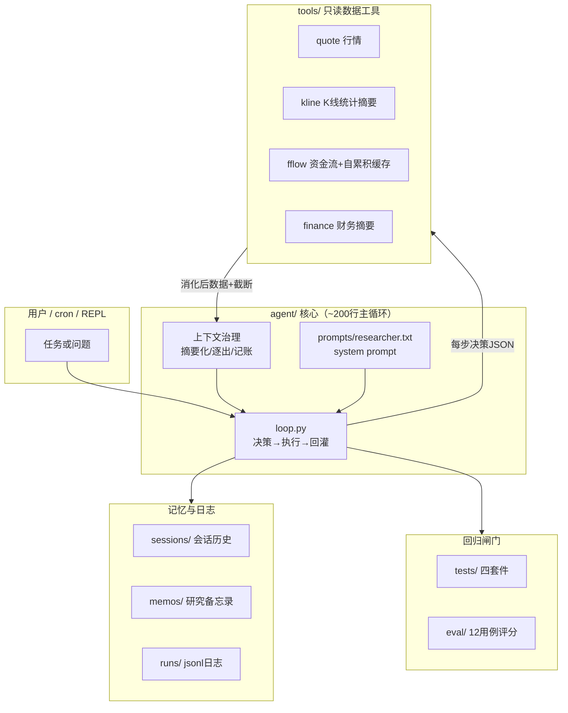

# A股研究员 Agent

[](https://github.com/Terry20161226/ashare-research-agent/actions/workflows/ci.yml)
[](LICENSE)

**[English]** A zero-framework A-share research agent: an LLM in a bare-metal loop that autonomously decides which tool to call next, with a four-tier circuit breaker, a context-budget discipline (summarize → evict → account), two-layer memory (session + research memos), and a 12-case eval suite. 200-line core loop, production-deployed, zero API cost (Hermes gateway).

一个零框架、从零手写的 A 股个股研究智能体。**LLM 在循环里，自主决定下一步调哪个工具**：
给它一个任务或问题，它自己完成"取数 → 分析 → 成稿"，全程只引用工具返回的真实数据。

主循环约 200 行（`agent/loop.py`），刻意保持能一口气读完——这个项目同时也是
"Agent 到底是什么"的最小实现样本：Agent = LLM + 工具 + 循环 + 熔断，其余都是工程。

## 真实产出（先看证据再读代码）

| 模式 | 任务 | 产出 |
|---|---|---|
| 走势问答 | "分析下 002017 后续最有可能的走势" | [→ examples/question-002017-trend.md](examples/question-002017-trend.md) |
| 多轮指代 | "研究 000001" → 追问"**它的**主力资金流入还是流出" | [→ examples/multi-turn-pingan.md](examples/multi-turn-pingan.md) |
| 生产流水线 | 每日 16:30 cron 自动研究队列 top3 候选 | [→ examples/research-600362-production.md](examples/research-600362-production.md) |

生产事故的完整复盘（现象/根因/修复/回归断言）见 [docs/incidents.md](docs/incidents.md)
——LLM JSON 四种脏形态、日志文件碰撞、上下文膨胀、多轮指代可读性缺陷，
每一条都有 `runs/*.jsonl` 或评估结果可查。

## 架构



## 能做什么

```bash
# 四段式研究草稿（基本面画像/近期走势/资金动向/风险提示）
python3 main.py "研究 600519 贵州茅台"

# 直接回答具体问题：结论 + 倾向 + 每条依据的硬度标注 + 数据缺口
python3 main.py "分析下 002017 后续最有可能的走势"

# 多轮对话：会话=文件，历史自动续接，追问可用指代词（"它的估值高吗"）
python3 main.py "研究 000001 平安银行" --session demo
python3 main.py "它的主力资金最近在流入还是流出" --session demo

# 或进入交互 REPL
python3 chat.py --session demo
```

研究/问答两模式由任务措辞驱动，同一套循环与工具。回答中的观点会逐条标注硬度
（[高]=数据直接支持 / [中]=数据暗示 / [低]=推断），数据缺口如实说明，绝不编造数字。

内置工具（全部只读）：腾讯实时行情快照（现价/估值/市值/换手）、腾讯日K线
（统计摘要化：区间统计+近10日明细+量比）、东财主力资金流（三级host回退 +
本地自累积缓存）、东财财务摘要（最近4个报告期营收/归母净利及同比）。

跨会话记忆两层：同会话历史续接（只灌结论摘要不灌工具明细）；任务含代码时
自动检索该标的历史研究备忘录注入——agent 能说"较 8/26 研究时现价+X%"。

## 快速开始

```bash
pip3 install -r requirements.txt        # 唯一依赖：requests
cp .env.example .env                    # 填入任意 OpenAI 兼容 API key
python3 main.py "研究 600519" --verbose
```

`.env` 默认指向 DeepSeek（便宜、JSON 输出稳），换通义千问只需改三行——
任何 OpenAI 兼容端点都可以。不填 key 也能先验证全部管道（mock LLM 驱动
真实循环 + 真实数据接口，零成本）：

```bash
python3 tests/test_parser.py       # 解析器五种脏输出形态（纯离线，CI也跑）
python3 tests/test_plumbing.py     # mock全链路10条断言：决策/熔断/逐出/写门/日志
python3 tests/test_memory.py       # 记忆层：会话回环/备忘录检索/注入（离线）
python3 tests/test_fc.py           # function calling协议转换+schema导出（离线）
python3 tests/test_tools.py        # 五个工具直连真实接口+错误路径
python3 stats.py                   # 运行观测画像：done率/步数/parse率/上下文峰值
```

注：数据源为腾讯/东财国内端点，运行环境需能访问国内网络；Python 3.9+（在 3.11/3.12 验证）。

## 代码目录

```
main.py               CLI 入口（--session 多轮续接 / --protocol 双协议 / --approve-write）
chat.py               交互式多轮 REPL（/new /history /exit）
stats.py              运行观测画像：done率/步数/parse率/上下文峰值/工具分布
agent/
  loop.py             ★ 主循环：决策->执行->回灌->再决策（核心，先读这个）
  memory.py           两层记忆：会话续接 + 跨会话研究备忘录检索
  llm.py              OpenAI兼容客户端：双决策协议(prompt-JSON/原生function calling)
  llm_hermes.py       可选通道：本地hermes gateway复用（见"部署形态"）
  trunc.py            工具输出截断 adapter（防上下文裸灌）
  config.py           .env 加载
tools/
  __init__.py         ★ 工具注册表：描述即提示词、错误结构化返回、schema导出
  quote.py            腾讯实时行情（GBK编码）
  kline.py            腾讯日K线（统计摘要化：区间统计+近10日明细+量比）
  fflow.py            东财主力资金流（push2→push2his→push2delay 回退链
                      + stockdata/ 自累积缓存：接口间歇性只回当日时历史靠每日运行累积）
  finance.py          东财财务摘要（datacenter，最近4个报告期）
  watchlist.py        观察清单（全项目唯一写工具，演示人工审批门）
prompts/
  researcher.txt      system prompt（落文件；{{TOOLS}} 由注册表自动注入）
tests/                工具实测 + mock 全链路 + 记忆层 + FC协议（不需要 API key）
eval/                 评估集：12用例规则化评分（改提示词前后必跑）
deploy/               可选部署样例（ECS + 飞书投递 + 研究队列联动）
runs/                 运行日志：真实任务在 runs/，测试在 runs/tests/，评估在 runs/eval/
sessions/             会话记忆（每轮Q/A追加，跨进程续接）
memos/                研究备忘录归档（--save-memo，跨会话检索源）
```

## 设计决策（为什么这样写）

- **主循环手写**：loop 是 agent 的全部本质，200 行读完之前不碰框架。
- **能力=提示词**：支持问答模式没有改一行循环代码，只改了 prompt——工具层与
  循环层稳定后，能力迭代收敛到提示词工程。
- **会话=文件，每轮独立运行**：多轮对话不做常驻进程——每轮仍是独立的
  `Agent.run`（全部熔断/预算隔离保留，进程崩了会话不丢），历史经
  `sessions/<id>.jsonl` 续接注入，REPL 只是薄壳。主循环零结构改动。
- **上下文预算纪律**：进上下文的必须是消化过的东西。三层闸：工具侧
  统计摘要化（K线 3000→821 字符，区间统计直接给出分位/放量日，省得
  agent 再调工具重查）；运行中逐出（工具结果只留最近 3 条原文，更早
  折叠为桩并明示"如需引用请重新调用"——16 步任务终局 36K→7K 字符，
  实测工具结果占上下文 86%）；逐步记账（每步 context_chars 落日志，
  真实运行峰值 2.5K~4.7K）。宁可让它重查一次，也不裸灌原始数据。
- **工具描述 = system prompt 的一部分**：注册表 `TOOL_SPECS` 是工具清单的
  唯一事实源，改 `desc` 等于改提示词，会影响模型路由决策。
- **错误写给 LLM 看**：`tools/execute()` 永不裸抛异常——失败返回
  「错误原因 + 下一步建议」，否则 LLM 看不到错误就会开始编造。
- **截断闸**：所有工具结果进 messages 前过 `truncate()`（每工具有独立限额）。
  宁可让 agent 缩小 days 重查，也不裸灌 200 行原始数据。
- **四重熔断**：步数硬顶 max_steps（默认15）→ 耗尽后一次 forced_final
  无工具收尾 → 连续3次 JSON 解析失败中止 → LLM通道故障预算内重试、
  连续3次熔断。agent 最贵的行为是「再试一次」。
- **宽容 JSON 解析**：LLM 输出脏是常态，解析器四层兜住——剥 markdown 围栏
  → 首个配平 JSON 对象（深度+字符串状态跟踪，丢弃尾部回声）→
  `json.loads(strict=False)`（容忍字符串内真实换行）→ 漏数嵌套右括号时
  自动补齐（仅当内容完整；字符串中途截断则不救，走重试路径，绝不产出
  半截答案）。五种生产事故脏形态全部有回归断言。
- **数据源诚实标注**：东财资金流接口间歇性只返回当日——三级 host 回退链
  （push2→push2his→push2delay）之外，用本地自累积缓存补历史（每次运行
  并入当日行），输出末行标注数据来源。agent 引用时如实转述，不把
  "只有一天数据"包装成"趋势"。
- **prompt_hash**：每次运行把 system prompt 的 md5 指纹写进日志头部——
  行为突变时先对 hash，再查是谁改了提示词或工具描述。
- **写操作人工审批门**：工具注册表标记 `write=True` 的写工具默认被拦截
  （cron/CI 等无人值守场景天然只读），显式 `--approve-write` 才放行；
  拦截信息写给 LLM 看，它继续只读完成任务并在回答中如实注明。
- **双决策协议**：同一注册表单一事实源，既渲染 prompt 文本也导出
  OpenAI function calling schema——`--protocol json` 走 prompt-JSON
  （带四层解析兜底），`--protocol fc` 走原生 function calling（finish
  伪工具承载 done 信号）。两种协议共用同一套循环、熔断与评估集。
- **jsonl 运行日志**：每步 decision/tool_result/parse_error/final 落盘
  `runs/`，排障先看日志再猜原因；`stats.py` 从日志聚合运行画像
  （done率/步数/parse率/上下文峰值/工具分布）。

## 如何加一个新工具

1. `tools/` 下写纯函数：入参用简单标量，返回给 LLM 看的字符串（格式化好、
   带表头）；失败直接抛异常（注册表会包装成带建议的错误信息返回给 LLM）。
2. 在 `tools/__init__.py` 的 `TOOL_SPECS` 注册：`func` / `desc`（什么情况
   该用它，这决定模型路由）/ `args` 必填 / `optional_args` 可选 / `limit`
   结果进入上下文的截断上限。
3. `python3 tests/test_tools.py` 回归，再跑一次真实任务看路由是否正确。

## 评估集（改提示词/解析器/工具前后必跑）

"改提示词等于改代码"——这个仓库的回归闸门分两层：

```bash
python3 tests/test_parser.py       # 离线：解析器五种脏输出形态（CI自动跑）
python3 eval/run_eval.py --llm hermes   # 全链路：12用例×规则评分（需LLM通道）
```

评估集覆盖五类任务：研究（3）、问句（3）、红线（1，要求拒绝仓位指令）、
边界（3，坏代码/不存在代码/无代码任务）、多轮对话（2，第二轮用指代词
"它"考上下文续接与指代消解）。评分项：正常收尾、零 parse_error、
输出纪律（数据截至行、硬度标注、拒绝买入指令、指代锚定标的）。
结果落盘 `eval/results_*.jsonl`。

## 实测成绩（2026-08-26）

- 评估集：10 单轮用例两战全 PASS 零 parse_error；多轮用例首跑暴露指代
  可读性缺陷（数据锚定正确但答案未点名标的），prompt 修复后重验通过
  ——评估集抓真问题，修复有前后对照
- 多轮对话实战："研究 000001" → 追问"**它的**主力资金最近在流入还是流出"
  （任务零代码）：指代正确消解；资金流仅 1 日直测数据时用量价结构做
  [中] 级间接推断并如实标注——诚实纪律在多轮场景成立
- 上下文管理：16 步任务终局 36K→7K 字符（-80%），K线工具 3000→821
  字符；真实运行上下文峰值 2.5K~4.7K
- 生产连续运行 10+ 次全部正常收尾（4~9 步完成），部署形态：ECS + cron
  每交易日 16:30 多任务研究 + 飞书群投递 + 研究队列联动 + 备忘录归档
- 值得记录的涌现行为：任务"研究一下今天的大盘"（无指数工具）——agent
  自行发现指数代码（如 399001）能穿过行情工具查询，自主完成大盘研究
- 硬度标注的可信度验证：问 600519 估值，它把"60日区间71%分位"标[高]
  （工具数据直接算出），把"20倍PE处历史低位"标[低]（无历史序列数据，
  是模型常识推断）——不拿常识冒充数据

## 运行日志与排障

```bash
python3 main.py "研究 000001 平安银行" --verbose   # 看每步决策
cat runs/run_*.jsonl | tail -5                     # 最近一次运行
```

`stopped` 取值含义：`done` 正常完成 / `forced_final` 步数耗尽被强制收尾 /
`max_steps` 收尾机会也没听话（查日志看卡在哪）/ `parse_failures` 连续输出
垃圾 / `llm_error` LLM 通道连续故障。

## 部署形态（可选，非必需）

本仓库默认单机单次运行。仓库另附一套零 API 成本部署样例：LLM 走本地
hermes gateway（`--llm hermes`），cron 定时运行并把结果投递到飞书群
（`deploy/agent-research.sh`）。开源使用者不需要这些，`.env` 配任意
OpenAI 兼容 key 即为完整功能。

```bash
# 定时运行 + 飞书投递（须先部署 hermes gateway）
cp deploy/agent-research.sh ~/.hermes/scripts/
hermes cron create '30 16 * * 1-5' --name agent-research \
  --script agent-research.sh --no-agent --deliver feishu:<chat_id>
```

可选联动 `deploy/update_task.py`：从外部交易系统的研究队列文件（只读）
自动挑选当日研究对象写入 TASK.txt（带5天冷却去重；TASK.txt 首行加 `!`
前缀可手动覆盖），队列缺失或格式不符时自动跳过——集成层永不阻断主流程。

## 红线

1. 本 agent 只产出研究草稿与观点分析，**永不接入交易执行**——LLM 幻觉率
   不为零，涉钱环节永久人工确认。
2. 工具只读公开行情数据，无任何写操作。
3. 工具描述与 prompts 改动前先跑 `tests/`（改提示词等于改代码）。

## 非目标（现阶段）

- 不接交易执行（永久红线）
- 完整财务三表/同业估值对比/公告事件等深度工具未内置（财务摘要已内置；
  扩展方法见"如何加一个新工具"）
- 会话记忆暂不做长期蒸馏（当前保留最近 5 轮；跨会话靠备忘录检索）

## License

MIT
